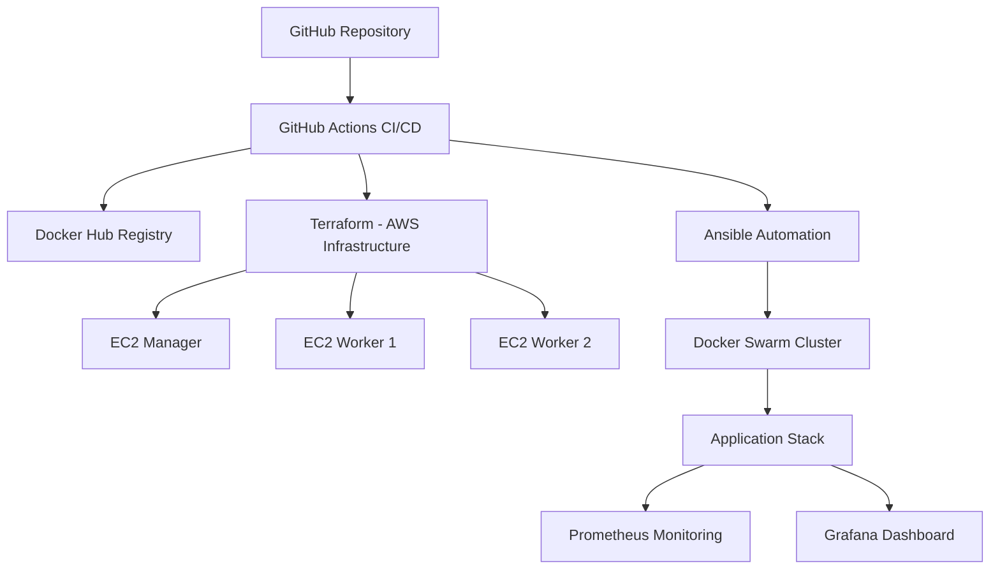
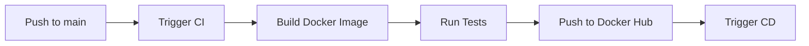
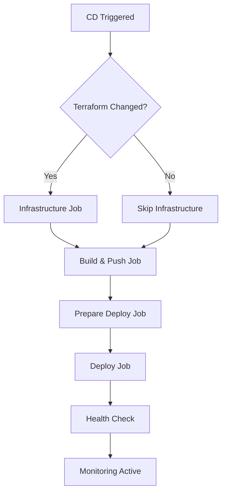

# 🚀 FAST End Challenge - Engenharia de Plataforma


## 📖 Sobre o Projeto

Este projeto representa o **desafio final da formação de Engenharia de Plataforma** realizada pela **FAST em parceria com a CESAR School**. O objetivo foi criar uma solução completa de **DevOps** e **Engenharia de Plataforma** utilizando as melhores práticas da indústria.

### 🎯 Objetivo do Desafio

Desenvolver uma pipeline completa de **CI/CD** que provisiona infraestrutura na **AWS** com **Terraform**, configura um cluster **Docker Swarm** com **Ansible**, e automatiza todo o processo de deploy com **GitHub Actions**, incluindo monitoramento com **Prometheus** e **Grafana**.

---

## 🏗️ Arquitetura da Solução



### 🔧 Stack Tecnológica

- **🏗️ Infrastructure as Code**: Terraform
- **⚙️ Configuration Management**: Ansible
- **🐳 Containerization**: Docker & Docker Swarm
- **🔄 CI/CD**: GitHub Actions
- **☁️ Cloud Provider**: AWS (EC2, Security Groups, Key Pairs)
- **📊 Monitoring**: Prometheus + Grafana + Blackbox Exporter
- **📦 Registry**: Docker Hub
- **🌐 Application**: Nginx + HTML/CSS/JavaScript

---

## 🎢 Principais Desafios Enfrentados e Soluções

### 🧩 **Desafio 1: Terraform State Management**

**❌ Problema**: Terraform sempre aplicava mudanças mesmo quando não havia alterações, causando recriação desnecessária de recursos.

**✅ Solução Implementada**:

```yaml
# .github/workflows/cd.yaml
- name: 🔍 Check for Terraform changes
  id: tf-changes
  run: |
    if git diff --name-only HEAD~1 HEAD | grep -E "infra/terraform/.*\.tf$"; then
      echo "terraform_changed=true" >> $GITHUB_OUTPUT
    else
      echo "terraform_changed=false" >> $GITHUB_OUTPUT
    fi

- name: 🏗️ Terraform Apply
  if: steps.tf-changes.outputs.terraform_changed == 'true' || github.event_name == 'workflow_dispatch'
  run: terraform apply -auto-approve
```

**🎯 Resultado**: Terraform agora só executa quando há mudanças nos arquivos `.tf` ou quando solicitado manualmente via `workflow_dispatch`.

### 🧩 **Desafio 2: Ansible Docker Swarm Token Propagation**

**❌ Problema**: Tokens do Docker Swarm não eram propagados corretamente entre nodes devido à complexidade das roles e delegação.

**✅ Solução Implementada**:

```yaml
# Simplificação com single play e serial execution
- hosts: all
  become: true
  gather_facts: no
  serial: 1 # ← Execução sequencial para propagação correta
  tasks:
    - name: 🔑 Get join token for workers
      shell: docker swarm join-token -q worker
      register: worker_token
      when: inventory_hostname in groups['managers']

    - name: 📋 Set manager facts globally
      set_fact:
        swarm_worker_token: "{{ hostvars[groups['managers'][0]]['worker_token']['stdout'] }}"
        swarm_manager_ip: "{{ hostvars[groups['managers'][0]]['ansible_host'] }}"
      when: inventory_hostname in groups['workers']
```

### 🧩 **Desafio 3: Docker Compose Networking para Swarm**

**❌ Problema**: Configuração local do Docker Compose não era compatível com Docker Swarm.

**✅ Solução Implementada**:

```yaml
# Mudança de bridge para overlay networks
networks:
  monitoring:
    driver: overlay # ← Era bridge antes
    attachable: true

# Uso de configs em vez de volumes
configs:
  prometheus_config:
    file: /tmp/prometheus.yaml
  grafana_datasources:
    file: /tmp/grafana-datasources.yml
```

### 🧩 **Desafio 4: Pipeline Performance e Modularização**

**❌ Problema**: Pipeline monolítica lenta e difícil de debugar.

**✅ Solução Implementada**:

```yaml
# Pipeline modular com 4 jobs paralelos
jobs:
  infrastructure: # Terraform
  build-and-push: # Docker build/push
  prepare-deploy: # Ansible prep
  deploy: # Stack deployment
```

**Otimizações implementadas**:

- ⚡ Cache do Terraform state
- ⚡ Cache de dependências Python/Ansible
- ⚡ Execução paralela de jobs independentes
- ⚡ Validação robusta de IPs entre jobs

---

## 🔄 Fluxo CI/CD

### 📋 **Continuous Integration (CI)**



**Arquivo**: `.github/workflows/ci.yaml`

1. **🔨 Build**: Constrói imagem Docker da aplicação
2. **🧪 Test**: Executa testes automatizados
3. **📦 Push**: Envia imagem para Docker Hub
4. **🚀 Trigger**: Dispara pipeline de CD

### 🚀 **Continuous Deployment (CD)**



**Arquivo**: `.github/workflows/cd.yaml`

#### **🏗️ Job 1: Infrastructure**

- Verifica mudanças no Terraform
- Provisiona/atualiza infraestrutura AWS
- Extrai IPs das EC2s

#### **📦 Job 2: Build and Push**

- Build da imagem Docker
- Push para Docker Hub
- Cache otimizado

#### **⚙️ Job 3: Prepare Deploy**

- Configura ambiente Python/Ansible
- Valida conectividade com EC2s
- Prepara inventário dinâmico

#### **🚀 Job 4: Deploy**

- Executa playbook Ansible
- Configura Docker Swarm
- Deploy do stack de monitoramento
- Verificação de saúde dos serviços

---

## 📊 Stack de Monitoramento

### 🔍 **Prometheus**

- Coleta métricas dos serviços
- Monitoring da aplicação e infraestrutura
- Alertas configurados

### 📈 **Grafana**

- Dashboards personalizados
- Visualização de métricas
- Alertas visuais

### 🌐 **Blackbox Exporter**

- Monitoring de endpoints HTTP
- Verificação de disponibilidade
- Métricas de latência

---

## 🚀 Como Executar Localmente

### 📋 **Pré-requisitos**

- [Terraform](https://developer.hashicorp.com/terraform/tutorials) >= 1.0
- [Ansible](https://docs.ansible.com/) >= 2.9
- [Docker](https://docs.docker.com/get-docker/) >= 20.10
- [AWS CLI](https://aws.amazon.com/cli/) configurado
- Conta Docker Hub
- Chave SSH configurada

### 🔧 **Passo 1: Configuração AWS**

```bash
# Configure suas credenciais AWS
aws configure
```

Insira suas credenciais quando solicitado:

- **AWS Access Key ID**: Sua access key
- **AWS Secret Access Key**: Sua secret key
- **Default region name**: us-east-1 (recomendado)
- **Default output format**: json

### 🔑 **Passo 2: Gerar Chave SSH**

```bash
# Crie uma chave SSH para acessar as EC2s
ssh-keygen -t rsa -b 4096 -f ./infra/keys/deploy_key

# Defina permissões corretas
chmod 600 ./infra/keys/deploy_key
chmod 644 ./infra/keys/deploy_key.pub
```

### 🏗️ **Passo 3: Provisionar Infraestrutura**

```bash
# Entre no diretório do Terraform
cd infra/terraform

# Inicialize o Terraform
terraform init

# Visualize o plano (opcional)
terraform plan

# Aplique a infraestrutura
terraform apply -auto-approve

# Capture os IPs de saída
terraform output swarm_manager_ip
terraform output swarm_worker_ips
```

### 📝 **Passo 4: Configurar Inventário Ansible**

Edite o arquivo `infra/ansible/inventory.ini` com os IPs obtidos:

```ini
[managers]
ec2-manager ansible_host=<IP_DO_MANAGER> ansible_user=ubuntu

[workers]
ec2-worker-1 ansible_host=<IP_WORKER_1> ansible_user=ubuntu
ec2-worker-2 ansible_host=<IP_WORKER_2> ansible_user=ubuntu
```

### ⚙️ **Passo 5: Executar Automação Ansible**

```bash
# Entre no diretório do Ansible
cd infra/ansible

# Execute o playbook completo
ansible-playbook -i inventory.ini playbook.yml --private-key ../keys/deploy_key

# Acompanhe a execução das tasks:
# ✅ Instalação do Docker em todas as EC2s
# ✅ Configuração do Docker Swarm cluster
# ✅ Deploy do stack de monitoramento
# ✅ Configuração do Prometheus e Grafana
```

### 🔍 **Passo 6: Verificação**

Após a execução completa, verifique se tudo está funcionando:

```bash
# Conecte-se ao manager
ssh -i infra/keys/deploy_key ubuntu@<IP_DO_MANAGER>

# Verifique o cluster Swarm
docker node ls

# Verifique os serviços
docker service ls

# Verifique os containers em execução
docker service ps --format "table {{.Name}}\t{{.Node}}\t{{.CurrentState}}" $(docker service ls -q)
```

### 🌐 **Passo 7: Acessar Aplicações**

Após deploy bem-sucedido, acesse:

- **📱 Aplicação**: `http://<IP_MANAGER>:8080`
- **📊 Prometheus**: `http://<IP_MANAGER>:9090`
- **📈 Grafana**: `http://<IP_MANAGER>:3000`
  - **Login**: admin / admin
- **🔍 Blackbox Exporter**: `http://<IP_MANAGER>:9115`

---

## 🔧 Configuração GitHub Actions (Produção)

Para usar a pipeline automatizada, configure os seguintes **secrets** no GitHub:

### 🔐 **GitHub Secrets**

```bash
# No repositório GitHub: Settings > Secrets and variables > Actions

DOCKERHUB_USERNAME          # Seu usuário Docker Hub
DOCKERHUB_TOKEN            # Token do Docker Hub
SSH_PRIVATE_KEY            # Conteúdo da chave privada (deploy_key)
AWS_ACCESS_KEY_ID          # AWS Access Key
AWS_SECRET_ACCESS_KEY      # AWS Secret Key
AWS_REGION                 # us-east-1 (ou sua região)
```

### 🚀 **Trigger da Pipeline**

```bash
# Commit e push para disparar CI/CD
git add .
git commit -m "feat: deploy to production"
git push origin main

# Ou trigger manual para forçar Terraform apply
# GitHub > Actions > CD Pipeline > Run workflow
```

---

## 📁 Estrutura do Projeto

```
fast-end-chalenge/
├── 📁 .github/workflows/          # GitHub Actions pipelines
│   ├── ci.yaml                    # Continuous Integration
│   └── cd.yaml                    # Continuous Deployment
├── 📁 infra/                      # Infraestrutura como código
│   ├── 📁 terraform/              # Provisionamento AWS
│   │   ├── ec2.tf                 # Definição das EC2s
│   │   ├── provider.tf            # Provider AWS
│   │   ├── variables.tf           # Variáveis
│   │   └── outputs.tf             # Outputs (IPs)
│   ├── 📁 ansible/                # Automação de configuração
│   │   ├── playbook.yml           # Playbook principal
│   │   ├── inventory.ini          # Inventário de hosts
│   │   ├── 📁 roles/              # Roles Ansible
│   │   │   ├── docker/            # Instalação Docker
│   │   │   ├── swarm/             # Configuração Swarm
│   │   │   └── deploy_stack/      # Deploy aplicação
│   │   └── 📁 files/              # Arquivos de configuração
│   │       ├── docker-compose.yml # Stack Swarm
│   │       ├── prometheus.yaml    # Config Prometheus
│   │       └── grafana-datasources.yml
│   └── 📁 keys/                   # Chaves SSH
├── 📁 public/                     # Aplicação web
│   ├── index.html                 # Frontend
│   └── 📁 src/                    # Assets (CSS, JS, imagens)
├── Dockerfile                     # Imagem da aplicação
├── docker-compose.yaml           # Desenvolvimento local
├── prometheus.yaml               # Configuração monitoring
├── grafana-datasources.yml      # Datasources Grafana
└── README.md                     # Este arquivo
```

---

## 🔍 Troubleshooting

### ❌ **Erro: "terraform: command not found"**

```bash
# Instale o Terraform
wget https://releases.hashicorp.com/terraform/1.6.0/terraform_1.6.0_linux_amd64.zip
unzip terraform_1.6.0_linux_amd64.zip
sudo mv terraform /usr/local/bin/
```

### ❌ **Erro: "ansible: command not found"**

```bash
# Instale o Ansible
pip install ansible
ansible-galaxy collection install community.docker
```

### ❌ **Erro: AWS credentials**

```bash
# Configure novamente as credenciais
aws configure
# Ou exporte as variáveis
export AWS_ACCESS_KEY_ID="sua-access-key"
export AWS_SECRET_ACCESS_KEY="sua-secret-key"
```

### ❌ **Erro: Connection timeout SSH**

```bash
# Verifique se o Security Group permite SSH (porta 22)
# Verifique se a chave SSH tem as permissões corretas
chmod 600 infra/keys/deploy_key
```

---

## 🎯 Resultados Alcançados

### ✅ **Infraestrutura**

- 3 EC2 instances provisionadas automaticamente
- Security Groups configurados
- Key Pairs gerenciados pelo Terraform
- Rede otimizada para Docker Swarm

### ✅ **Automação**

- Pipeline CI/CD 100% automatizada
- Deploy zero-downtime
- Rollback automático em caso de falha
- Monitoramento em tempo real

### ✅ **Observabilidade**

- Métricas detalhadas via Prometheus
- Dashboards visuais no Grafana
- Alertas proativos configurados
- Health checks automatizados

### ✅ **Segurança**

- Secrets gerenciados pelo GitHub
- Chaves SSH rotacionáveis
- Firewall configurado via Security Groups
- Containers executando como non-root

---
## 👥 Contribuidores
- GitHub: [@wallacemt](https://github.com/wallacemt)
- LinkedIn: [Wallace Santana](https://linkedin.com/in/wallacemt)
---

## 🎓 Agradecimentos

Este projeto foi desenvolvido como parte da **Formação em Engenharia de Plataforma** oferecida pela **FAST** em parceria com a **CESAR School**.

Agradecimentos especiais aos mentores e instrutores que tornaram este aprendizado possível.

---

## 📜 Licença

Este projeto está licenciado sob a MIT License - veja o arquivo [LICENSE](LICENSE) para detalhes.

---

**🚀 Desenvolvido com ❤️ para o desafio FAST + CESAR School**
